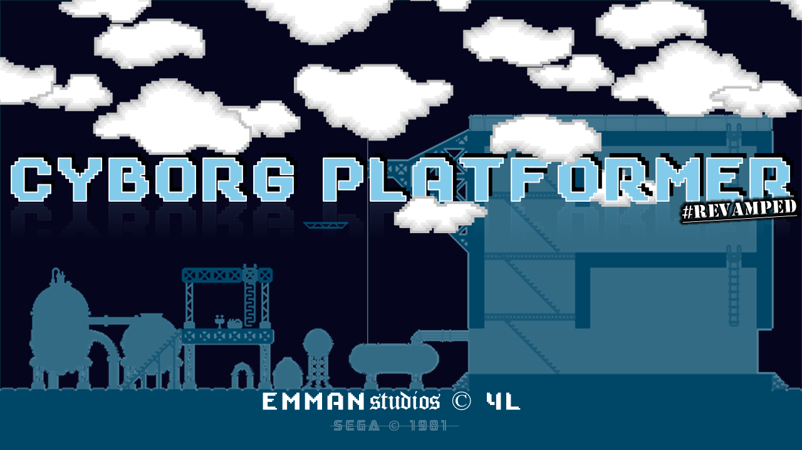

Cyborg Platformer



This is a zombie shooter platformer built for the COMP2013 coursework at the University of Nottingham. The module hands out a small, deliberately messy **Java Swing** codebase (V1) as a legacy baseline, and the coursework is to restore, document, test, refactor, and extend it across three versions. All of the V1 gameplay code, assets, and initial docs were provided as the starting point; everything from V1's runnable-baseline fixes onward, the V2 refactor, and the V3 feature work is my own.

In the game, you navigate a level, avoiding obstacles and zombies and tracking your score. It features:

- **Physics-Based Movement**: Simple gravity and collision detection mechanics made by hand.
- **Zombie Shooter**: Engage with enemies while platforming through the levels.
- **HUD**: Displays health, score, attempts, and a timer.
- **Dynamic Level Loading**: Levels are loaded from a text file, where each character represents a different platform or object type.

All sprites and images are from [CraftPix](https://craftpix.net/freebies/). Big thanks to them for providing these awesome assets for free!

To play, ensure all required image files are organized in the `src` directory as per the setup instructions, and launch the game by running `CyborgPlatformer.legacy.CyborgPlatform.java`.

# COMP2013 Context

This repository is used for the COMP2013 Coursework. Work is completed across:
 - V1 - maintenance
 - V2 - refactoring
 - V3 - extension

Development is carried out on `dev` and per-task branches.

## Evolution (V1 → V3)

**V1 (provided baseline):** A working but structurally poor Swing game. `canvas` acted as a God Object,
driving both rendering and simulation via `paint(Graphics g)`, while gameplay entities (`Player`, `Enemy`,
`bullet`) reached back into global static state (`CyborgPlatform.game`, `canvas.activeBullets`, etc.) instead
of being owned by a proper controller. Collision logic was tightly coupled to movement code. My Task 1-3 work
restored a runnable baseline, Javadoc'd the legacy code, and added the first regression test suite over it.

**V2 (refactor):** The legacy code was moved into a `legacy` package (`cc3e404`) so it stayed intact while a
new architecture was introduced alongside it. Key changes:
 - `World` became the authoritative owner of entities and level state, replacing global collections.
 - Collision/environment logic was extracted into `TileLevel`, `SolidBlock`, and `TileLevelLoader` (`0dd1497`).
 - The UI moved to JavaFX behind a thin `FxLauncher` bootstrap with no game logic (`a75d58a`).
 - `GameController` became the single orchestrator mediating input and `World` updates (`c237654`).
 - `Renderer` was pulled into its own `view` package as a read-only renderer of world state, backed by a
   centralised `AssetManager`, with `Camera` isolated from entity/update logic.

**V3 (extension):** Built on top of the V2 architecture: a `config` package with `GameMode`/`LevelSettings`
and JSON-backed presets wired into the UI, level settings threaded through `World`/`Enemy`/`GameController`,
spawn scheduling and respawn-on-death behaviour, an upgraded title screen and menu, and skin customisation
with a live in-menu preview.

See [Software Design](docs/SoftwareDesign.md) for the full class-diagram-level writeup this summary is based on.

## How to Run

### IntelliJ IDEA (recommended)
1. Open the repository folder in IntelliJ. 
2. When prompted, import the project as a **Maven project**. 
3. Ensure Project SDK is set to **Java 17**. 
4. Locate the main class: `CyborgPlatformer.legacy.CyborgPlatform` (in src folder).
5. Right-click the class and select **Run 'CyborgPlatformer.legacy.CyborgPlatform'**.

### Command Line (Maven)
From the repository root directory:

```bash
mvn clean compile
mvn exec:java -Dexec.mainClass=CyborgPlatformer.legacy.CyborgPlatform
```

> Note: If the Maven exec plugin is not configured, the project can be run directly
> from IntelliJ by running the `CyborgPlatformer.legacy.CyborgPlatform` main class.

### Controls and objective

## How to Play

**Goal:** Reach the end of the level while avoiding hazards and zombies. The **higher** the score the better!

**Controls (currently):**
- Move Left: A
- Move Right: D
- Jump / Double-Jump: W (press again during initial jump animation)
- Shoot: SPACE
- Restart: ESC
- Pause: N/A

> Note: The in-game instruction overlay does not match these controls yet (tracked as a Task 2 fix).

## Project Structure

- `src/` – Java source files
- `src/<resources>` – sprite/image assets
- `gifs/` – gameplay preview GIFs
- `docs/` (or root mark down files) – coursework documentation

## Documentation

- [Changelog](Changelog.md)
- [Software Design](SoftwareDesign.md)
- [Testing](Testing.md)

## Gameplay Preview


